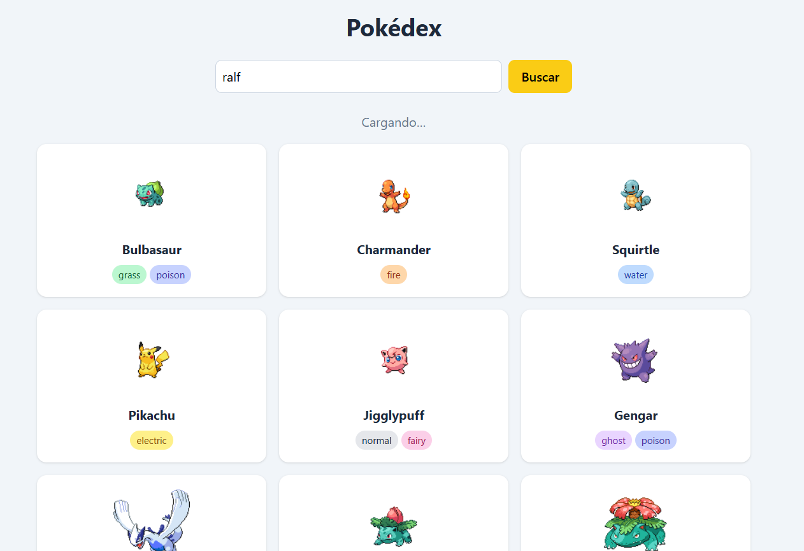
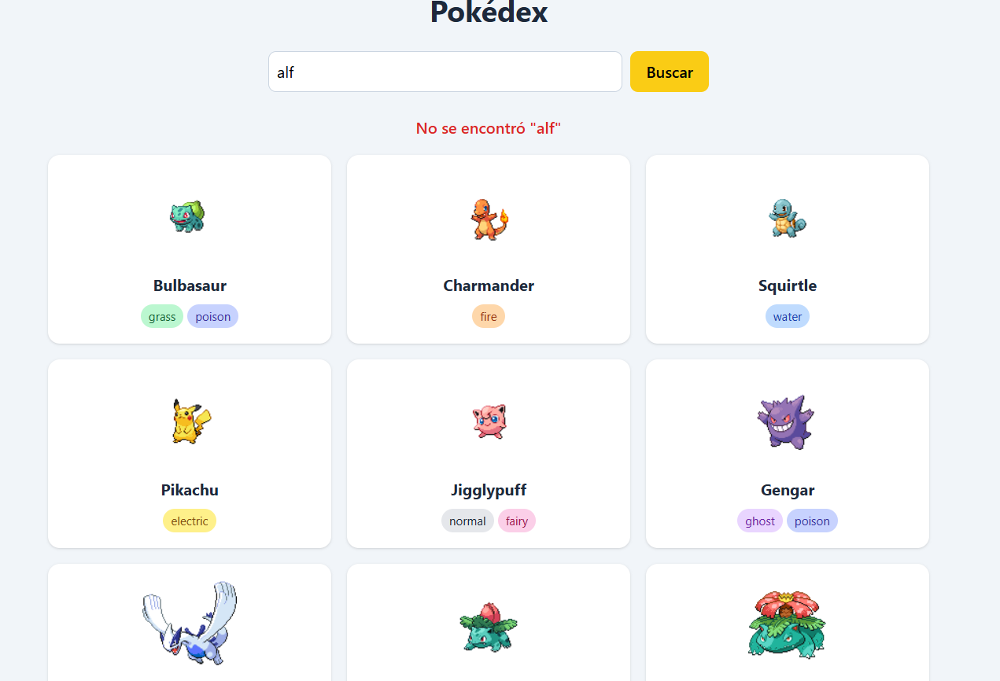

# Pokédex

Buscador de Pokémon que consume la PokeAPI con manejo de errores, control de estados asíncronos y carga de datos en tiempo real.

## Cómo usarlo

1. Abre el sitio desplegado.
2. Escribe el nombre de un Pokémon por ejemplo "Charmander" y presiona **Buscar** para agregarlo.
3. Usa el botón "Cargar mas" para traer de forma paginada nuevas tarjetas a la rejilla.

## Tecnologías

- JavaScript (`fetch`, `async/await`, `Promise.all`, `try/catch/finally`)
- Tailwind CSS
- [PokeAPI](https://pokeapi.co/)

## Explicación del try/catch y Promesas en mis funciones

Así apliqué la lógica de los laboratorios en mi código:

- **En la función `cargarPokedex` (Carga inicial):** Usé `Promise.all` con `await` para pedir los primeros 6 Pokémon en paralelo y que carguen rápido. Metí todo en un `try/catch` para que, si falla la conexión al abrir la página, muestre el mensaje en pantalla. El `finally` lo usé para ocultar el "Cargando..." siempre.
- **En la función `obtenerPokemon` (Validación de errores):** Como `fetch` no detecta si un Pokémon existe o no, puse un `if (!response.ok)`. Si la API responde que no lo encontró, uso un `throw new Error` para mandar un mensaje personalizado y activar el `catch`.
- **En la función `mostrarBusqueda` (El buscador):** Aquí puse un `try/catch` para capturar la búsqueda. Si todo está bien, dibuja la tarjeta del Pokémon. Si el usuario escribe algo mal (como "pikachuu"), el `catch` agarra el error personalizado que creamos antes y lo pinta en rojo en la pantalla con el contenedor `#mensaje`.
- **En la función `cargarMas` (Botón Cargar más):** También le puse `try/catch` por si el usuario se queda sin internet justo cuando le da clic al botón de cargar los siguientes 12 Pokémon, evitando que la página se congele.

## Demo y Capturas

### Estado de cargando

### Mensaje de error

🔗 [Ver en GitHub Pages](https://gianpierre533.github.io/Pokedex/)
